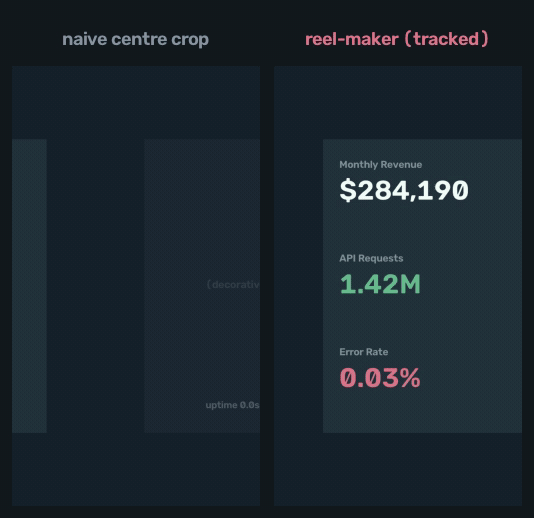

# reel-maker

Turn landscape video into vertical reels **locally** — with a crop that actually follows the
content instead of guessing at the middle.

Most auto-croppers center-crop and hope. On a screen recording that throws away the half of
the frame the viewer needed. `reel-maker` builds a per-frame importance map from
**spectral-residual saliency plus on-screen text detection**, then glides a smoothed virtual
camera to hold the important region — so headings, form fields and UI labels stay readable at
9:16. Nothing is uploaded; ffmpeg and OpenCV do the work on your machine.



*Same 1920×1080 source, both cropped to 1080×1920. The dashboard's numbers sit in the left
third, so a centre crop keeps the decorative panel and throws away the content. Reproduce it
yourself: `python scripts/make_demo_clip.py demo.mp4 && reel-maker demo.mp4 out.mp4 --no-card-fill`.*

## Install

```bash
pip install reel-maker            # core: reframing
brew install ffmpeg               # required (or: apt install ffmpeg)
```

Two optional extras, both genuinely optional — the core install works without them:

```bash
pip install 'reel-maker[ocr]'      && brew install tesseract   # text-aware tracking
pip install 'reel-maker[captions]'                             # Whisper burn-in captions
```

Without `[ocr]` the tracker degrades to saliency-only and tells you so; it does not crash.

## Quickstart

```bash
reel-maker input.mp4 output.mp4
```

That detects scene cuts, picks a treatment per shot, and writes a 1080×1920 reel. For crisp
UI recordings, drop the CRF:

```bash
reel-maker input.mp4 output.mp4 --fallback card --crf 14
```

Inspect what it decided before committing to a render:

```bash
reel-maker input.mp4 out.mp4 --dump-shots
```

## How the tracking works

The interesting part is choosing **one** framing per shot rather than chasing a centroid
frame by frame — a camera that re-aims every frame reads as jitter, however accurate it is.

1. **Sample** the clip at `--analyze-fps` (default 3). For each sample, compute a
   spectral-residual saliency map, and — if OCR is available — add a mask of confident
   Tesseract word boxes weighted by `--text-weight` (default 2.5). Text wins ties, because
   on a screen recording text is the payload.
2. **Collapse** each sample to a horizontal *importance profile*: how much important content
   sits in each of 240 vertical columns.
3. **Detect cuts** by frame-to-frame difference on a 32×18 thumbnail, merging shots shorter
   than `--min-shot` so a flickering transition doesn't produce a twitchy reframe.
4. **Choose one center per shot** — the crop-width window capturing the most cumulative
   importance across that shot's profiles, not the per-frame argmax.
5. **Smooth, then clamp.** Moving-average the path *within* each shot and rate-limit it with
   `--max-speed`. Critically, both reset at cut boundaries: averaging across a hard cut would
   drag the camera out of the old subject and into the new scene, so each shot frames its
   subject immediately instead of gliding in.

A separate classifier decides which shots are flat **text cards** — high background flatness,
low edge density, low intra-shot motion — and fits those to width with edge extension instead
of cropping, so a wide title reads in full.

## Treatments

Set per shot in a JSON shot list, or as `--fallback` for automatic runs. This choice is most
of the difference between a reel that looks intentional and one that looks cheap.

| mode | What it does | Use for |
|---|---|---|
| `crop` | 9:16 slice at native scale, panned to the important region. Borderless. | Screen recordings where UI must stay **legible**; a centered subject. |
| `fill` | Scales the subject up to fill the frame. `zoom` sets the punch-in. | A device or product you want big. |
| `extend` | Fit to width, replicate top/bottom edge rows. Invisible on a flat background; **streaks if content touches the edges**. | Flat solid/gradient **text cards**. |
| `extend` + `freeze` | Pads from clean edge rows captured at the range start, so UI animating in at the edges doesn't smear. Add `"pad":"auto"` for flat backgrounds. | Title cards with animated entrances. |
| `card` | Composites the frame onto a rounded card over a gradient. Never streaks. | Full-bleed people/product/UI you want framed. |
| `anim` | Keyframed `cover`/`cx`/`opacity` with smoothstep easing. | Choreographed moments — fade in, settle, glide. |
| `reveal` | Holds a fill while a logo grows, then eases to `extend` so an over-wide logo reveals in full. | Animated logo and title reveals. |
| `blur` | Shrunk, blurred fill. | Last resort — most viewers dislike blur bars. |

### Shot list

Overrides are applied by time range and may split a detected shot:

```json
[
  {"t0": 2.45, "t1": 3.45,  "mode": "reveal", "hold": 2.9, "ease": 0.15},
  {"t0": 8.80, "t1": 10.60, "mode": "card", "bg_top": [112,0,208], "bg_bot": [112,0,208]},
  {"t0": 14.20,"t1": 16.40, "mode": "extend", "freeze": true, "pad": "auto"},
  {"t0": 16.27,"t1": 19.00, "mode": "anim", "keys": [
     {"t":16.27,"cover":1.55,"cx":0.66},
     {"t":17.30,"cover":1.00,"cx":0.66},
     {"t":18.25,"cover":0.62,"cx":0.28}]},
  {"t0": 20.60,"t1": 23.00, "mode": "crop", "cx": 0.38}
]
```

```bash
reel-maker input.mp4 output.mp4 --shots shots.json --crf 14
```

Keys: `t0`,`t1` (seconds) · `mode` · `cx` (0–1 pan center) · `zoom` · `hold`/`ease` (reveal) ·
`keys` (anim) · `freeze`/`pad` (extend) · `radius`/`margin`/`bg_top`/`bg_bot` (card, **BGR**).

## Design principles

These are the rules the defaults encode, worth knowing when you override them:

- **Borderless.** Fill the frame, or use `card`/`extend` on a matching background. Black bars
  and blur read as an afterthought.
- **Never clip the payload.** Full logos, full headlines, whole numbers. If it won't survive a
  crop, use `card`, `extend` or `reveal`.
- **Never streak.** Don't `extend` a shot with a device, photo or UI touching the top/bottom
  edge — use `card`, or `freeze`. `--band-thr` (default 0.9) is the automatic guard.
- **One composition per shot.** Move only deliberately, with `anim` or `reveal`, and continue
  the source's own motion rather than fighting it.
- **Stay consistent** across the whole video — match card backgrounds to the scene.

## Captions

```bash
reel-maker-captions in.mp4 out.mp4 --lang es --model small
```

Whisper transcription chunked into short phrases with a bold lower-third burn-in. Caption
**after** reframing — sizing assumes the 1080×1920 canvas. Models download on first use.

## Quality and file size

CRF is quality-based, so flat cards stay small no matter what you ask for. The default
`--crf 20` over-compresses static UI; use `--crf 14`. If you need true source-scale file
sizes, force CBR afterwards — note that `-minrate` alone will not do it:

```bash
ffmpeg -i in.mp4 -c:v libx264 -preset medium \
  -b:v 10M -maxrate 10M -minrate 10M -bufsize 10M \
  -x264-params "nal-hrd=cbr:force-cfr=1" -pix_fmt yuv420p -c:a copy out.mp4
```

## Limits

- Tested on macOS and Linux. Windows is untested.
- OCR tracking needs the `tesseract` binary; without it you get saliency-only tracking.
- Optimised for 16:9 → 9:16. Other source aspects work but the treatment classifier is
  tuned for widescreen.
- The `extend` classifier is heuristic. On an unusual palette, check `--dump-shots` and
  override rather than trusting it.

More recipes — batch loops, multi-language sets, transcripts, music and logo overlays — in
[`docs/recipes.md`](docs/recipes.md).

## License

Apache-2.0. See [LICENSE](LICENSE).
